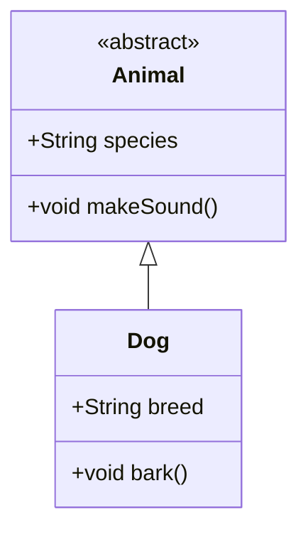

```mermaid
classDiagram
    class Animal {
        <<abstract>>
        +String species
        +void makeSound()
    }

    class Dog {
        +String breed
        +void bark()
    }

    Animal <|-- Dog
```
